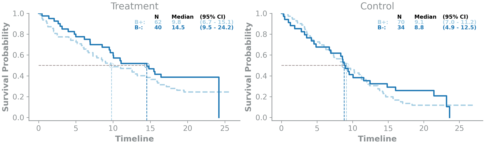

# PBMF 
we present an automated neural network framework based on contrastive learning, which we have named the predictive biomarker modeling framework (PBMF). This general-purpose framework explores potential predictive biomarkers in a systematic and unbiased manner.


 Under the hood, the contrastive loss in the PBMF searches for a biomarker that maximizes the benefit under treatment of interest while at the same time minimizes the effect of the control treatment.

## Run notebook and explore results

```bash

git clone https://github.com/gaarangoa/pbmf.git
cd ./pbmf/

docker build . --tag pbmf

docker run -it --rm -p 8888:8888 pbmf jupyter notebook --NotebookApp.default_url=/lab/ --ip=0.0.0.0 --port=8888 --allow-root

```

